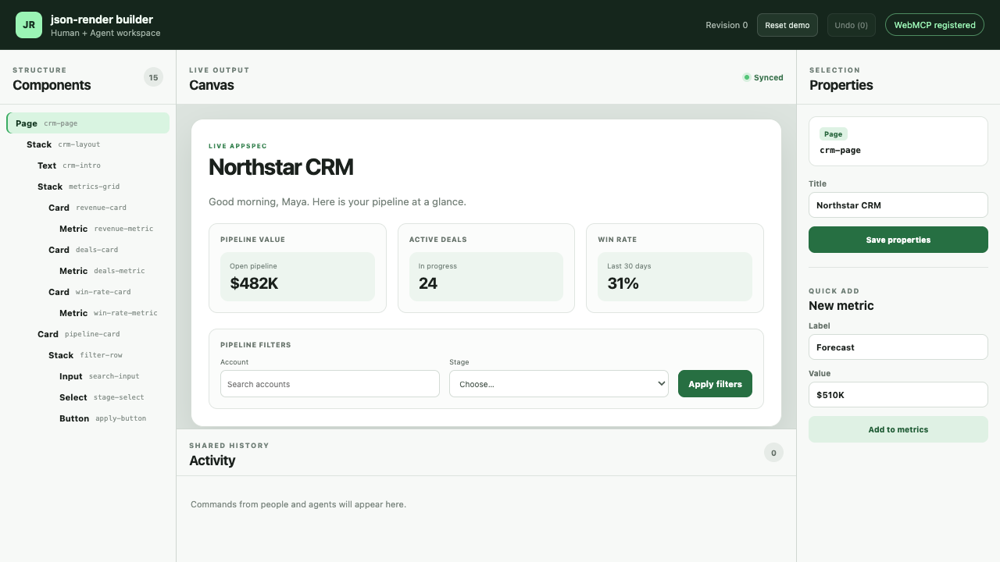
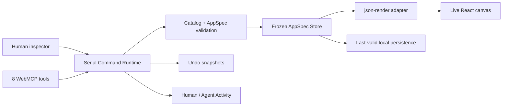
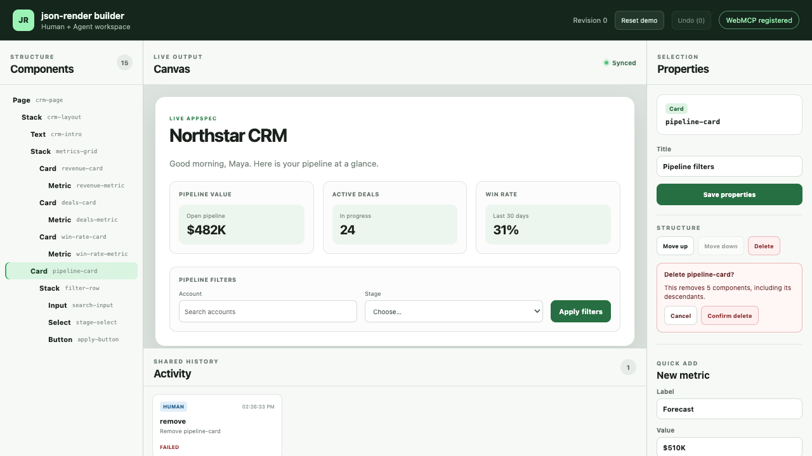
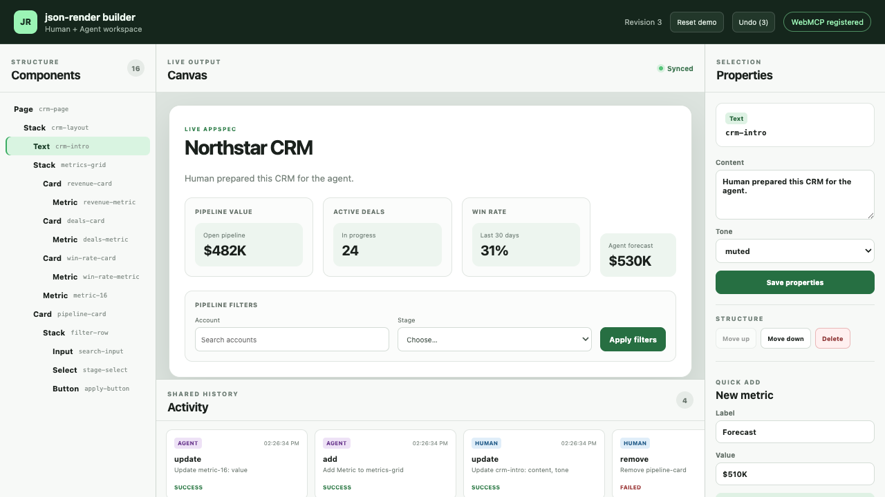

# json-render-ai

An agent-native low-code workspace where people and browser agents safely build the same application together.

Humans edit a structured component inspector. Agents discover eight WebMCP tools for reading, adding, updating, moving, validating, removing, and undoing. Both paths enter one serial Command Runtime, update one validated AppSpec, and render immediately through the real [`json-render`](https://github.com/vercel-labs/json-render) React renderer.



## Why WebMCP

Visual builders are difficult for agents: controls are spread across a changing DOM, IDs are unstable, and destructive actions can be ambiguous. WebMCP gives this builder a bounded, documented editing surface while the human keeps a visual inspector, confirmation controls, Undo, and a shared audit trail.

The result is a workflow that was awkward before WebMCP: an agent can inspect and restructure a visual application without guessing at UI selectors, while its human collaborator sees every change on the same canvas and can reject or reverse it.

## What works

- Eight validated component types: Page, Stack, Card, Text, Metric, Button, Input, and Select
- Eight native WebMCP tools: `describe_app`, `list_components`, `add_component`, `update_component`, `move_component`, `remove_component`, `validate_app`, and `undo_last_change`
- Human and Agent writes serialized by one Command Runtime
- Atomic Catalog and structural validation with path-level errors
- Revision-bound deletion preview and explicit confirmation
- Twenty-step snapshot Undo and a 50-entry redacted human/Agent Activity log
- Versioned local persistence with damaged-data recovery
- Deterministic Northstar CRM demo reset
- Real Chrome 152 WebMCP discovery and invocation tests without a production shim

## Architecture



The UI and WebMCP adapter never mutate the Store directly. The only AppSpec-to-json-render mapping lives under `src/adapters/json-render/`.

WebMCP registration uses the standard browser surface:

```ts
registerWebMcpTools(runtime, document.modelContext)
```

Each descriptor is ultimately registered with `document.modelContext.registerTool(...)` semantics and disposed through an `AbortSignal`.

## Run locally

Requirements:

- Node.js 22.12 or later
- pnpm 11.20 or later
- Google Chrome 149 or later for native WebMCP testing (Chrome 152 is verified)

```bash
git clone https://github.com/nice-hang/json-render-ai.git
cd json-render-ai
pnpm install --frozen-lockfile
pnpm dev
```

Open `http://127.0.0.1:4173`. Click **Reset demo**, select `Text crm-intro`, edit Content, and click **Save properties**. The component tree, real json-render canvas, revision, Undo, persistence, and Activity update from the same Runtime command.

## Verify

```bash
pnpm format
pnpm lint
pnpm typecheck
pnpm test
pnpm test:e2e
pnpm build
```

The native WebMCP lane launches an isolated local Chrome session with the official testing flag and performs the complete competition flow three consecutive times:

```bash
pnpm test:webmcp:real
```

This lane does not inject a page shim. It calls native `document.modelContext.getTools()` and the Chrome testing `executeTool()` interface. The ordinary E2E adapter fixture is clearly separated and is not used as protocol evidence.

After deployment, run the same native three-rehearsal flow against the public HTTPS origin. This command does not start or substitute a local server:

```bash
PRODUCTION_URL=https://your-deployment.example pnpm test:e2e:production
```

## Three-minute demo

Follow [`docs/DEMO_SCRIPT.md`](docs/DEMO_SCRIPT.md). The deterministic sequence includes:

1. Reset and identify the four workspace regions.
2. Make a visible human Text update.
3. Let the Agent discover, read, add, update, and move through native WebMCP.
4. Open deletion confirmation and cancel it; state stays unchanged.
5. Let the Agent preview and confirm removal, then undo it.
6. Show the human/Agent Activity trail and final validation.

The timed, word-for-word English voice-over is in [`docs/VIDEO_NARRATION.md`](docs/VIDEO_NARRATION.md).





## Deployment

`pnpm build` creates a static Vite application in `dist/`, suitable for any HTTPS static host. A public challenge deployment URL will be added only after deployment is explicitly authorized and verified in a logged-out browser session.

## Current evidence

- Stage 0–4 verification: [`docs/evidence/`](docs/evidence/)
- Native three-run rehearsal and 1280×720 evidence: [`docs/evidence/2026-09-02-phase-4-verification.md`](docs/evidence/2026-09-02-phase-4-verification.md)
- Final acceptance matrix: [`docs/evidence/2026-09-02-mvp-acceptance-matrix.md`](docs/evidence/2026-09-02-mvp-acceptance-matrix.md) — 15/18 passed; external release gates are explicitly open
- Stage 5 release evidence: [`docs/evidence/2026-09-02-phase-5-verification.md`](docs/evidence/2026-09-02-phase-5-verification.md)

## Known limitations

- WebMCP is experimental. Ordinary browsers without WebMCP support show `WebMCP unavailable`; Chrome must enable `chrome://flags/#enable-webmcp-testing` or use the documented automated lane.
- AppSpec persistence is browser-local. Undo snapshots and Activity entries are session-local and intentionally reset on refresh.
- The MVP uses a fixed eight-component Catalog and structured commands; it does not accept arbitrary patches, executable code, cloud collaboration, or free-form drag-and-drop.
- The generated CRM is demonstration data, not a connected CRM backend.

## License

[MIT](LICENSE)
