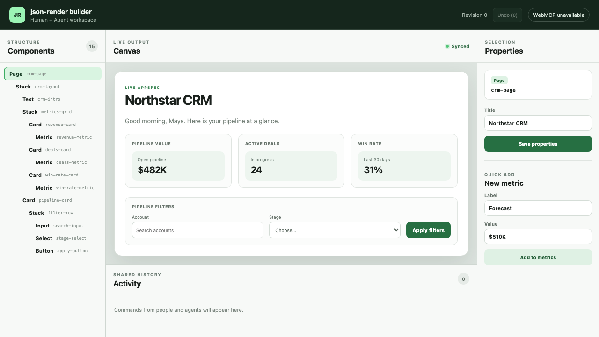

# Stage 3 Verification — Human Control and Recovery

- Date: 2026-09-02 (Asia/Shanghai)
- Baseline commit: `15492f7` on `main`
- Result: `verified`
- Stage 2 prerequisite: [`2026-09-02-phase-2-verification.md`](2026-09-02-phase-2-verification.md)

## Delivered behavior

- The inspector is driven by the fixed Catalog and exposes valid fields for all eight component types, including enum, number, long text, and string-list inputs.
- Human property updates, quick add, sibling move, deletion, template recovery, and undo all dispatch through the same Command Runtime used by WebMCP tools.
- Invalid properties display the first path-level error inline and leave AppSpec, revision, canvas, and persisted state unchanged.
- Deletion shows the stable target ID and recursive affected count. Cancel closes the confirmation without mutation; confirm uses the same revision-bound token contract as the Agent tool.
- Selection falls back to the nearest still-valid ancestor after deletion.
- History is bounded to 20 committed pre-state snapshots; Activity is bounded to 50 entries.
- Activity records source, command, status, ISO time, and a value-free summary. Summary text is credential-pattern redacted and limited to 160 characters.
- A versioned localStorage envelope saves only validated AppSpecs after a 100 ms coalescing delay. Invalid JSON, unknown storage versions, and invalid AppSpecs are preserved and trigger an explicit CRM/blank recovery choice.

## Focused unit and integration evidence

```text
pnpm test
Test Files 7 passed (7)
Tests      46 passed (46)
exit 0
```

Coverage includes:

- Catalog fields rendered for Page, Stack, Card, Text, Metric, Button, Input, and Select;
- path-level invalid-property feedback with deep-equal Runtime state;
- UI deletion cancel, recursive confirm, parent selection fallback, and undo;
- exact reverse restoration after 20 alternating human/Agent updates;
- 20-entry history and 50-entry Activity bounds;
- failed Agent source attribution, credential-style summary redaction, and summary truncation;
- add/update/move/remove undo contracts inherited from Stage 2;
- invalid JSON, unknown version, and invalid AppSpec recovery fixtures with the original raw storage unchanged;
- valid storage round-trip and throttled write behavior;
- read-only Runtime publications causing no persistence write.

## Browser recovery and human-control evidence (AC-09–AC-12)

```text
pnpm test:e2e
property inspector rejects invalid input and delete requires confirmation — passed
refresh restores the last valid AppSpec — passed
human move uses the shared Runtime and updates component order — passed
20 step undo restores the original AppSpec through the human UI — passed
damaged storage is preserved until explicit template recovery — passed
Stage 1 human and adapter regressions — passed
7 passed
exit 0
```

The browser tests prove:

1. A Gap value of 99 reports `/nodes/metrics-grid/props/gap`; revision remains zero.
2. Removing `pipeline-card` previews five affected components; Cancel keeps it and keeps revision zero.
3. Confirm removes only the subtree, selects `crm-layout`, and Undo restores it.
4. A human sibling move changes both Runtime revision and component-tree order.
5. Twenty submitted property changes produce depths 1–20; twenty UI Undo actions restore the original field value and depth zero.
6. A changed Text value survives a browser reload.
7. The literal corrupted storage value `{damaged` remains untouched until the user chooses Restore blank; recovery then writes a valid versioned blank AppSpec.

## Native WebMCP regression

```text
pnpm test:webmcp:real
real Chrome discovers and executes the complete shared editing flow — passed
1 passed
exit 0
```

Chrome 152 still discovers exactly eight native tools and completes human update plus Agent read/add/update/move/remove/undo after the persistence and history changes. No shim is installed in this lane.

## 1280×720 visible inspection



The local Vite application was captured at an exact 1280×720 viewport and visually inspected. Components, Canvas, Properties, Activity, revision, Undo, and WebMCP state are visible without overlap; canvas and inspector controls remain readable. `WebMCP unavailable` is expected in this ordinary browser launch without the native feature flags and is not protocol evidence.

## Full Stage 3 quality gate

```text
pnpm install --frozen-lockfile  exit 0
pnpm format                    exit 0
pnpm lint                      exit 0
pnpm typecheck                 exit 0
pnpm test                      exit 0 (7 files, 46 tests)
pnpm test:e2e                  exit 0 (7 tests)
pnpm test:webmcp:real          exit 0 (1 native Chrome test)
pnpm build                     exit 0 (139 modules transformed)
```

Production assets: CSS 8.98 kB (2.68 kB gzip), JavaScript 369.06 kB (110.88 kB gzip).

## Exit mapping

| Acceptance slice         | Result | Evidence                                                        |
| ------------------------ | ------ | --------------------------------------------------------------- |
| AC-02 Catalog editor     | passed | all-eight-type component test + inline path error               |
| AC-03 shared Runtime     | passed | human commands and native WebMCP regression                     |
| AC-04 live selection     | passed | move/delete browser flows and ancestor fallback                 |
| AC-09 confirmation       | passed | cancel/confirm browser flow + token core tests                  |
| AC-10 undo               | passed | 20-step unit and 20-step UI restoration                         |
| AC-11 audit              | passed | source/status/time/summary UI + bounds/redaction tests          |
| AC-12 persistence        | passed | three corrupt fixtures + refresh and recovery E2E               |
| G3.1 last valid snapshot | passed | invalid data preservation and validation-before-write           |
| G3.2 snapshot undo       | passed | exact pre-state stack; no command replay                        |
| G3.3 safe logs           | passed | value-free summaries, credential redaction, 160-character limit |

## Known limits

- Undo snapshots and Activity entries are session-local and reset on refresh; only the latest valid AppSpec persists. Cross-refresh history is outside the confirmed MVP.
- Persistence is local to the current browser origin; cloud sync and collaboration remain out of scope.

Stage 4 may now productize the CRM demonstration and its visual/error storytelling without changing the recovery contracts.
