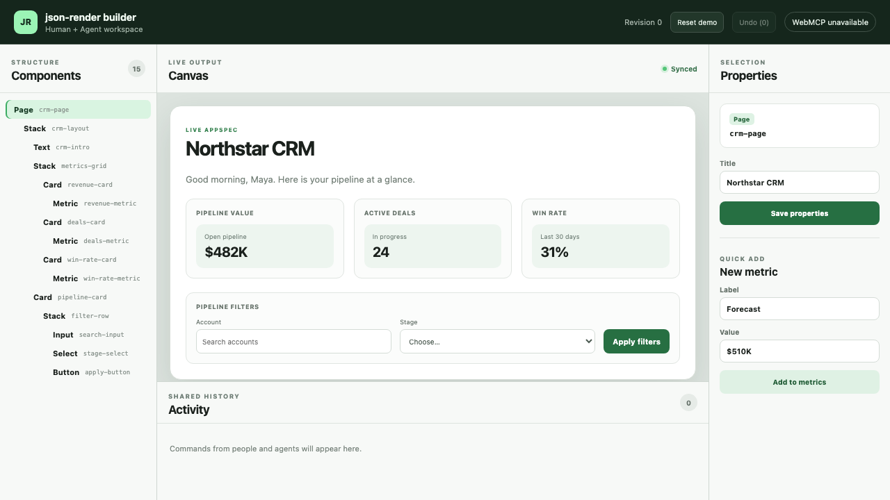

# Stage 4 Verification — Demo Productization

- Date: 2026-09-02 (Asia/Shanghai)
- Baseline commit: `6d34115` on `main`
- Result: `verified`
- Stage 3 prerequisite: [`2026-09-02-phase-3-verification.md`](2026-09-02-phase-3-verification.md)

## Delivered behavior

- **Reset demo** uses the existing serial Command Runtime to restore the exact 15-node CRM fixture while clearing revision, history, pending confirmations, selection, and Activity without a page reload.
- The repeatable [`../DEMO_SCRIPT.md`](../DEMO_SCRIPT.md) fixes narration, visible outcomes, exact structured inputs, and a 2–3 minute sequence.
- The script includes human update; native Agent describe/list/add/update/move; visible human deletion cancellation; Agent deletion preview and confirmation; Agent undo; validation; and human/Agent Activity.
- The desktop shell is fixed to the viewport with internal panel scrolling, so all four regions remain within 1280×720.
- A consistent focus-visible outline and stable accessible names support the keyboard path.
- Loading, unavailable, registration-error, empty Activity, inline validation, confirmation, and persistence-recovery states have visible UI instead of relying on console output.

## Deterministic reset evidence (G4.2)

Runtime and browser tests first create changed state, then invoke Reset demo and assert:

- AppSpec deep-equals the built-in CRM template;
- exactly 15 component-tree buttons exist;
- `Northstar CRM` and the original greeting are visible;
- revision is 0, Undo depth is 0 and disabled;
- Activity is empty and its empty-state guidance is visible.

## Three native Chrome rehearsals (AC-13 / G4.1)

```text
pnpm test:webmcp:real
REHEARSAL 1: 622ms, passed
REHEARSAL 2: 533ms, passed
REHEARSAL 3: 556ms, passed
competition demo succeeds 3 consecutive times through native WebMCP — passed
1 test, 3 independent browser contexts, exit 0
```

Each context used Google Chrome 152 with native `document.modelContext.getTools()` and `executeTool()`. No shim was injected. Every rehearsal independently:

1. discovered exactly the eight required tool descriptors;
2. reset to the deterministic CRM state;
3. committed and displayed a human Text update;
4. called native describe and list;
5. called native add/update/move for `metric-16` and observed tree/canvas changes;
6. opened the human deletion confirmation and cancelled it, observing unchanged state;
7. called native remove preview and observed unchanged state;
8. called native confirmed remove and observed deletion;
9. called native undo and observed restoration;
10. called native validate and observed both source types in Activity;
11. asserted zero page errors and zero console errors.

The measured automated interaction time is not presented as narration duration; it proves a very large margin under the 180-second limit. The fixed script allocates 140 seconds at normal speaking pace.

## 1280×720 clarity and keyboard evidence (AC-14 / G4.3)



The new-session screenshot was visually inspected. Components, Canvas, Properties, Activity, revision, Reset, Undo, and protocol state are simultaneously readable. Automated bounding-box assertions prove all four panels remain inside the exact viewport. Keyboard Tab first reaches Reset demo with a non-`none` computed focus outline. The four region headings are exposed by accessible roles and names.

The screenshot uses an ordinary browser launch, so `WebMCP unavailable` is expected there. Native protocol proof comes only from the separate real-Chrome lane above.

## E2E regression matrix

```text
pnpm test:e2e
10 passed
exit 0
```

| Path                                  | Browser evidence                                        |
| ------------------------------------- | ------------------------------------------------------- |
| Human update/add and live json-render | Stage 1 vertical slice                                  |
| Invalid property                      | path-level error, revision/state unchanged              |
| Cyclic Agent move                     | adapter fixture rejects `/newParentId`, state unchanged |
| Rejected deletion                     | visible affected count + Cancel, state unchanged        |
| Confirmed deletion and undo           | subtree removed, ancestor selected, exact restoration   |
| Damaged localStorage                  | original raw data preserved until explicit recovery     |
| Refresh recovery                      | last valid Text value restored after reload             |
| Human move                            | component-tree order and revision change                |
| 20-step recovery                      | 20 UI commits and 20 UI undos restore original          |
| Reset and clarity                     | deterministic reset, viewport bounds, keyboard focus    |

The cyclic-move browser test explicitly injects an adapter fixture and is not counted as real WebMCP evidence. Real tool discovery/calling is established by the three native rehearsals. A repository scan found no `test.skip`, `it.skip`, `describe.skip`, `.only`, or `test.fixme` markers.

## Full Stage 4 quality gate

```text
pnpm install --frozen-lockfile  exit 0
pnpm format                    exit 0
pnpm lint                      exit 0
pnpm typecheck                 exit 0
pnpm test                      exit 0 (7 files, 48 tests)
pnpm test:e2e                  exit 0 (10 tests)
pnpm test:webmcp:real          exit 0 (3 native rehearsals)
pnpm build                     exit 0 (139 modules transformed)
```

Production assets: CSS 9.06 kB (2.71 kB gzip), JavaScript 369.53 kB (111.01 kB gzip).

## Exit mapping

| Acceptance slice         | Result | Evidence                                                               |
| ------------------------ | ------ | ---------------------------------------------------------------------- |
| AC-13 demo stability     | passed | 3/3 independent native rehearsals, each under 1 second automation time |
| AC-14 clarity            | passed | exact viewport screenshot, region bounds, headings, keyboard focus     |
| AC-15 quality gates      | passed | full command sequence and no skipped critical tests                    |
| G4.1 real calls          | passed | native Chrome three-rehearsal lane                                     |
| G4.2 deterministic reset | passed | Runtime deep equality + browser fixture assertions                     |
| G4.3 visible state       | passed | screenshot, visible errors/confirmation/logs, accessibility tests      |

## Known limits

- A public production URL and public demo video remain unexecuted because those external operations require explicit authorization.
- Ordinary browsers without enabled WebMCP support correctly show `WebMCP unavailable`; Chrome 152 with the documented flags is the verified local demonstration environment.

Stage 5 may now prepare clean-clone, repository, license, screenshot, description, deployment, and submission artifacts. It must stop once an external deployment, public video publication, or competition submission is the next action.
